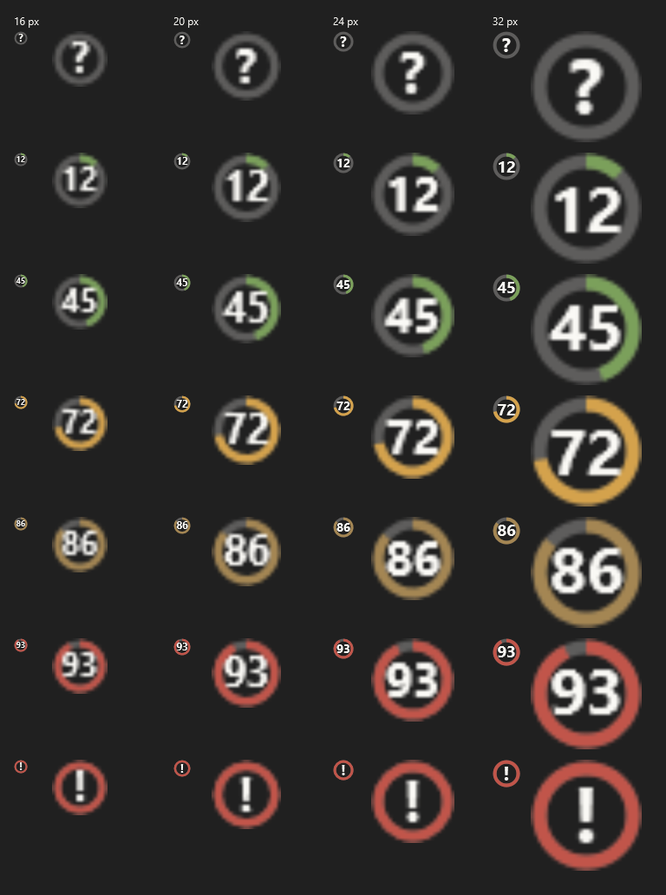
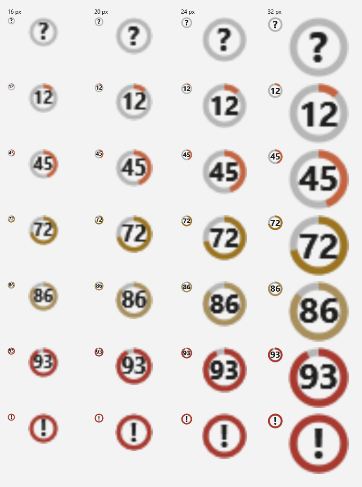
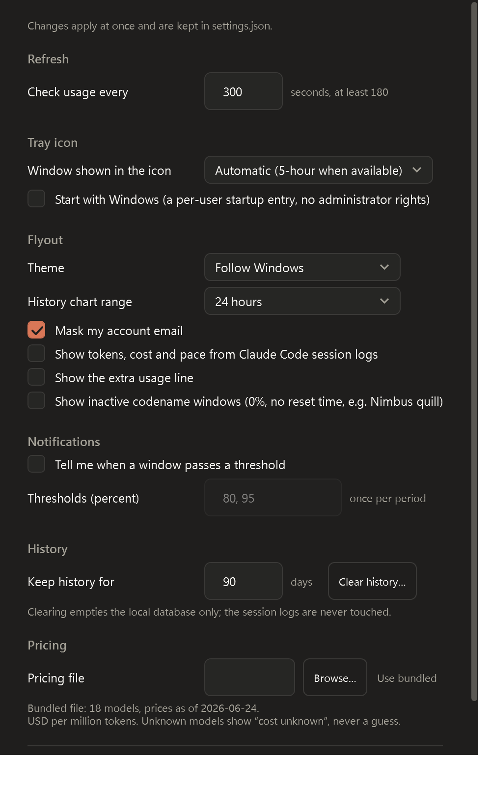
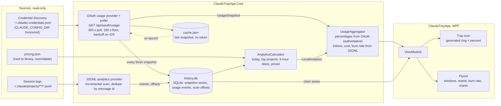

# Claude Usage Tray

A minimalist Windows 11 system-tray app that shows your Claude usage at a glance: a live percentage in the tray
icon, and a small dark flyout with every usage window, reset countdowns, plan tier, burn rate, history charts and
local token/cost analytics.

[](https://github.com/mlcousek/claude_trayapp/actions/workflows/ci.yml)
[](LICENSE)

> **Unofficial tool.** Claude Usage Tray is a community project. It is not affiliated with, endorsed by, or supported
> by Anthropic. It relies on an undocumented endpoint that can change or stop working at any time.

> **Status: all eight milestones complete, first release v0.1.0.** Solution scaffold, CI, docs, the data layer
> (credential discovery, the usage endpoint provider with backoff and cache, verified live), the generated tray icon
> with its context menu, the flyout, local analytics from the session logs with history, the charts, settings with
> notifications, autostart and single instance, and the release pipeline. Downloads are on the
> [Releases page](https://github.com/mlcousek/claude_trayapp/releases); see [CHANGELOG.md](CHANGELOG.md) for what
> each version contains.

<p>
  
</p>

The tray icon in every state and size, on a dark and a light taskbar (native rendering with a 4x blow-up):

<p>
  
  
</p>

<!-- Screenshots are produced with `--render-icons` and `--capture-flyout`; the flyout capture never includes the account line. -->

## What it shows

- **Tray icon.** A ring-arc progress indicator around a compact numeral for the window you choose, coloured in the
  Claude accent (terracotta) while there is headroom and turning amber, then red, as the window fills; redrawn live
  and legible at 16 px on light and dark taskbars. The tooltip is a one-line summary.
- **Flyout (left-click).** Plan tier and masked account email; the 5-hour window as a large ring with a sparkline
  of the block so far; one compact row per other window with percent, thin bar, sparkline and "resets in 1h 26m";
  extra-usage balance when present; burn rate and projection for the current five-hour block; today's tokens and
  estimated cost with a per-model breakdown; and three charts, one at a time: this block (recorded percentages, the
  projection and the moment the limit would land), history of every window over 24 h, 7 d or 30 d, and tokens per
  day for two weeks, split by model on request. Hover a chart for the exact reading; every chart also has a
  one-sentence text equivalent.
- **Context menu (right-click).** Refresh, Settings, Open logs, Start with Windows (checkable), About, Quit.
- **Notifications (opt-in).** A Windows notification when a window passes a threshold you chose, at most once per
  window and period.

## Requirements

- Windows 11 (Windows 10 may work but is untested).
- Claude Code installed and signed in at least once. The app reads the OAuth token Claude Code stores locally. Without
  Claude Code there are no percentages; local analytics still work if session logs exist.
- No .NET installation needed. Releases are self-contained single-file executables for x64 and Arm64.

## Install

1. Download the zip for your machine from the [Releases page](https://github.com/mlcousek/claude_trayapp/releases):
   `ClaudeUsageTray-<version>-win-x64.zip` for x64 or `ClaudeUsageTray-<version>-win-arm64.zip` for Arm64, for
   example `ClaudeUsageTray-0.1.0-win-x64.zip`.
2. Verify the download. Every release lists the SHA256 of each zip in its notes and attaches the same list as
   `SHA256SUMS.txt`. Compute yours and compare:

   ```powershell
   Get-FileHash .\ClaudeUsageTray-0.1.0-win-x64.zip -Algorithm SHA256
   ```

   or, in Command Prompt:

   ```bat
   certutil -hashfile ClaudeUsageTray-0.1.0-win-x64.zip SHA256
   ```

3. Unzip anywhere and run `ClaudeTrayApp.exe`. The zip holds the app (one self-contained exe), `pricing.json`,
   `LICENSE.txt` and a short `README.txt`; keep the exe and `pricing.json` together. There is no installer and no
   admin prompt. The exe is not code-signed, so SmartScreen may ask once: choose **More info**, then **Run anyway**.
4. Optional: right-click the tray icon and choose **Start with Windows**.

Each release is built by the [release workflow](.github/workflows/release.yml) from the tagged commit; the same
zips are attached to the workflow run as an artifact.

From source (needs the .NET 9 SDK):

```bash
git clone https://github.com/mlcousek/claude_trayapp.git
cd claude_trayapp
dotnet run --project src/ClaudeTrayApp
```

## First run

- The app looks for `%USERPROFILE%\.claude\.credentials.json`, or `%CLAUDE_CONFIG_DIR%\.credentials.json` if that
  variable is set, and reads only the Claude OAuth section of it.
- If nothing is found, the icon shows a question mark and the flyout explains how to sign in with Claude Code.
- If the token has expired, the flyout says "open Claude Code to sign in again". The app never refreshes tokens itself.
- The first poll happens immediately, then every five minutes. The last result is cached so the flyout opens instantly
  on the next launch.

## Settings

Open **Settings** from the tray menu or from the flyout. Every change applies at once and is written to
`%APPDATA%\ClaudeTrayApp\settings.json`. The file is hot-reloaded, so you can also edit it by hand while the app
runs; a file that does not parse is left untouched and reported in the Settings window.

<p>
  
</p>

| Key | Default | What it does |
|---|---|---|
| `pollIntervalSeconds` | `300` | Seconds between usage checks. Values below 180 are raised to 180; a change re-times the wait in progress. |
| `trayWindow` | `"auto"` | Window key that drives the tray numeral (`five_hour`, `seven_day`, ...). `auto` picks the 5-hour window when present. |
| `chartRangeHours` | `24` | History chart range: 24, 168 or 720. The range pills in the flyout change it too. |
| `historyRetentionDays` | `90` | Percentages and token totals older than this are pruned. **Clear history** empties the local database; the session logs are never touched. |
| `notifications.enabled` | `false` | Windows notifications when a window passes a threshold. |
| `notifications.thresholds` | `[80, 95]` | Percentages, each announced at most once per window and period. |
| `showLocalAnalytics` | `false` | Show tokens, cost, pace and the daily chart derived from the session logs. |
| `showExtraUsage` | `false` | Show the extra-usage (overage) line when the plan has it enabled. |
| `showInactiveWindows` | `false` | Show codename windows the endpoint reports at 0 % with no reset time (for example "Nimbus quill"). The documented windows are always shown. |
| `maskEmail` | `true` | Mask the account email in the flyout; the flyout's Show/Hide button changes it too. |
| `theme` | `"system"` | `system`, `light` or `dark`. |
| `pricingFilePath` | `null` | Path to your own `pricing.json`; `null` means the bundled file. |

**Start with Windows** is not stored in the file: it is an opt-in, per-user `HKCU\...\Run` entry, toggled from the
tray menu or the Settings window and never needing administrator rights.

Only one instance runs per session. Launching the app again opens the running instance's flyout and exits.

## How the data sources work, and their limits

1. **Usage endpoint.** The same data Claude Code shows in its own usage view, fetched from
   `https://api.anthropic.com/api/oauth/usage` with the Claude Code token. It is undocumented: the response shape can
   change, and it rate-limits aggressively. The app polls no faster than every 180 s, backs off exponentially on 429
   up to 30 minutes, and keeps showing the last good result with a "stale" marker in the meantime. Percentages are
   never estimated locally; if the endpoint is unavailable the flyout says so.
2. **Local session logs.** Claude Code writes one JSONL file per session under `~/.claude/projects`. The app scans them
   incrementally to derive today's tokens, per-model and per-project breakdowns, the current five-hour block's burn
   rate and an estimated equivalent API cost. Cost uses a data-driven `pricing.json` with a visible effective date;
   unknown models show "cost unknown" rather than a wrong number. This works offline.

The full probed schemas and the rules derived from them are in [docs/data-sources.md](docs/data-sources.md).

## Privacy

- No telemetry, no analytics, no crash reporting. Nothing leaves your machine except the usage request to
  `api.anthropic.com`.
- The OAuth token is read from Claude Code's credential file, kept in memory, redacted from logs and never written
  anywhere by this app.
- The app writes only to `%LOCALAPPDATA%\ClaudeTrayApp` (cache, history database, logs) and
  `%APPDATA%\ClaudeTrayApp\settings.json`. It never modifies anything under `~/.claude`.
- Your account email is masked in the flyout by default.

## Troubleshooting

| Symptom | Likely cause | What to do |
|---|---|---|
| "Not signed in" | No credential file found | Run `claude` once and sign in. |
| "Open Claude Code to sign in again" | Access token expired (about eight hours) | Run any Claude Code command; it refreshes the token. |
| "Rate limited" or a stale marker | The endpoint returned 429 | Wait. The app backs off automatically; do not lower the poll interval. |
| Percentages unavailable, tokens still shown | Endpoint or network down | Local analytics keep working; percentages return when the endpoint does. |
| "Cost unknown" | Model id missing from `pricing.json` | Update the pricing file or point Settings at your own. |
| Want to check the setup end to end | | Run `ClaudeTrayApp.exe --probe`. It fetches once, writes a redacted summary to the newest log and exits with code 0 on success or 2 on failure. |
| Anything else | See the logs | `%LOCALAPPDATA%\ClaudeTrayApp\logs` (tokens are redacted). |

## Architecture



More in [docs/architecture.md](docs/architecture.md): layers, runtime folders, the polling state machine, the
component graph and the launch sequence. Contributors should also read [CLAUDE.md](CLAUDE.md).

## Contributing and security

See [CONTRIBUTING.md](CONTRIBUTING.md). Report vulnerabilities privately as described in [SECURITY.md](SECURITY.md).

## License

[MIT](LICENSE). Claude is a trademark of Anthropic, PBC; this project does not ship Anthropic's logo or branding.
