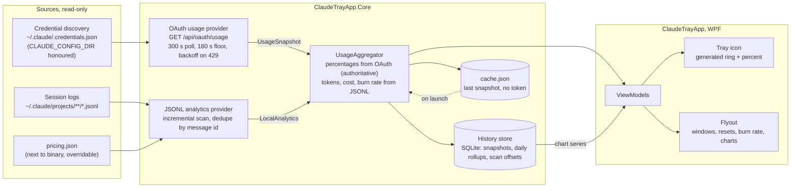

# Claude Usage Tray

A minimalist Windows 11 system-tray app that shows your Claude usage at a glance: a live percentage in the tray
icon, and a small dark flyout with every usage window, reset countdowns, plan tier, burn rate, history charts and
local token/cost analytics.

[](https://github.com/mlcousek/claude_trayapp/actions/workflows/ci.yml)
[](LICENSE)

> **Unofficial tool.** Claude Usage Tray is a community project. It is not affiliated with, endorsed by, or supported
> by Anthropic. It relies on an undocumented endpoint that can change or stop working at any time.

> **Status: pre-release, under construction.** Milestone 1 of 8 (solution scaffold, CI, docs) is complete. The tray
> icon, flyout, analytics and charts follow in the next milestones. No release exists yet; see
> [CHANGELOG.md](CHANGELOG.md) for progress.

<!-- Screenshot and GIF land in docs/screenshots/ with milestone 8. -->

## What it shows

- **Tray icon.** A ring-arc progress indicator around a compact numeral for the window you choose, colour-coded green
  to amber to red, redrawn live and legible at 16 px on light and dark taskbars. The tooltip is a one-line summary.
- **Flyout (left-click).** Plan tier and masked account email; one row per usage window with percent, thin bar,
  inline sparkline and "resets in 1h 26m"; extra-usage balance when present; burn rate and projection for the current
  five-hour block; history charts over 24 h, 7 d or 30 d; today's tokens and estimated cost with a per-model breakdown.
- **Context menu (right-click).** Refresh, Settings, Open logs, Start with Windows, About, Quit.

## Requirements

- Windows 11 (Windows 10 may work but is untested).
- Claude Code installed and signed in at least once. The app reads the OAuth token Claude Code stores locally. Without
  Claude Code there are no percentages; local analytics still work if session logs exist.
- No .NET installation needed. Releases are self-contained single-file executables for x64 and Arm64.

## Install

1. Download `ClaudeUsageTray-<version>-win-x64.zip` (or `win-arm64`) from the Releases page (available from v0.1.0).
2. Compare the SHA256 with the checksum listed in the release notes.
3. Unzip anywhere and run `ClaudeTrayApp.exe`. There is no installer and no admin prompt.
4. Optional: right-click the tray icon and choose **Start with Windows**.

From source (needs the .NET 9 SDK):

```bash
git clone https://github.com/mlcousek/claude_trayapp.git
cd claude_trayapp
dotnet run --project src/ClaudeTrayApp
```

## First run

- The app looks for `%USERPROFILE%\.claude\.credentials.json`, or `%CLAUDE_CONFIG_DIR%\.credentials.json` if that
  variable is set, and reads only the Claude OAuth section of it.
- If nothing is found, the icon shows a question mark and the flyout explains how to sign in with Claude Code.
- If the token has expired, the flyout says "open Claude Code to sign in again". The app never refreshes tokens itself.
- The first poll happens immediately, then every five minutes. The last result is cached so the flyout opens instantly
  on the next launch.

## Settings

Settings live in `%APPDATA%\ClaudeTrayApp\settings.json`, are hot-reloaded, and can be edited from the Settings window.
Final key names are fixed in milestone 7; the intended set is:

| Setting | Default | Notes |
|---|---|---|
| Poll interval | 300 s | Hard floor 180 s. |
| Tray window | auto | Which usage window drives the tray numeral. |
| Chart range | 24 h | 24 h, 7 d or 30 d. |
| History retention | 90 days | Plus a "clear history" action. |
| Notifications | off | Thresholds such as 80 % and 95 %, at most once per window per period. |
| Start with Windows | off | Per-user `HKCU\...\Run` entry, opt-in. |
| Show local analytics | on | Hide the JSONL-derived section entirely. |
| Mask email | on | Toggle from the flyout. |
| Theme | system | Follow Windows, or force light or dark. |
| Pricing file | bundled | Path to an alternative `pricing.json`. |

## How the data sources work, and their limits

1. **Usage endpoint.** The same data Claude Code shows in its own usage view, fetched from
   `https://api.anthropic.com/api/oauth/usage` with the Claude Code token. It is undocumented: the response shape can
   change, and it rate-limits aggressively. The app polls no faster than every 180 s, backs off exponentially on 429
   up to 30 minutes, and keeps showing the last good result with a "stale" marker in the meantime. Percentages are
   never estimated locally; if the endpoint is unavailable the flyout says so.
2. **Local session logs.** Claude Code writes one JSONL file per session under `~/.claude/projects`. The app scans them
   incrementally to derive today's tokens, per-model and per-project breakdowns, the current five-hour block's burn
   rate and an estimated equivalent API cost. Cost uses a data-driven `pricing.json` with a visible effective date;
   unknown models show "cost unknown" rather than a wrong number. This works offline.

The full probed schemas and the rules derived from them are in [docs/data-sources.md](docs/data-sources.md).

## Privacy

- No telemetry, no analytics, no crash reporting. Nothing leaves your machine except the usage request to
  `api.anthropic.com`.
- The OAuth token is read from Claude Code's credential file, kept in memory, redacted from logs and never written
  anywhere by this app.
- The app writes only to `%LOCALAPPDATA%\ClaudeTrayApp` (cache, history database, logs) and
  `%APPDATA%\ClaudeTrayApp\settings.json`. It never modifies anything under `~/.claude`.
- Your account email is masked in the flyout by default.

## Troubleshooting

| Symptom | Likely cause | What to do |
|---|---|---|
| "Not signed in" | No credential file found | Run `claude` once and sign in. |
| "Open Claude Code to sign in again" | Access token expired (about eight hours) | Run any Claude Code command; it refreshes the token. |
| "Rate limited" or a stale marker | The endpoint returned 429 | Wait. The app backs off automatically; do not lower the poll interval. |
| Percentages unavailable, tokens still shown | Endpoint or network down | Local analytics keep working; percentages return when the endpoint does. |
| "Cost unknown" | Model id missing from `pricing.json` | Update the pricing file or point Settings at your own. |
| Anything else | See the logs | `%LOCALAPPDATA%\ClaudeTrayApp\logs` (tokens are redacted). |

## Architecture



More in [docs/architecture.md](docs/architecture.md): layers, runtime folders, the polling state machine, the
component graph and the launch sequence. Contributors should also read [CLAUDE.md](CLAUDE.md).

## Contributing and security

See [CONTRIBUTING.md](CONTRIBUTING.md). Report vulnerabilities privately as described in [SECURITY.md](SECURITY.md).

## License

[MIT](LICENSE). Claude is a trademark of Anthropic, PBC; this project does not ship Anthropic's logo or branding.
