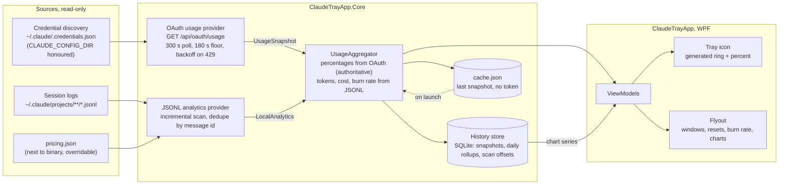
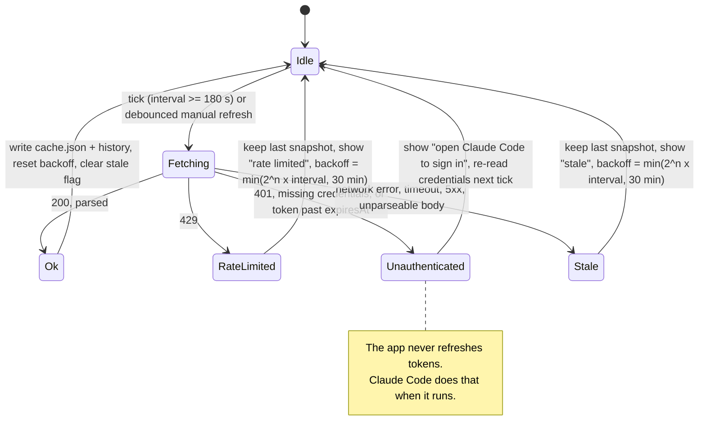
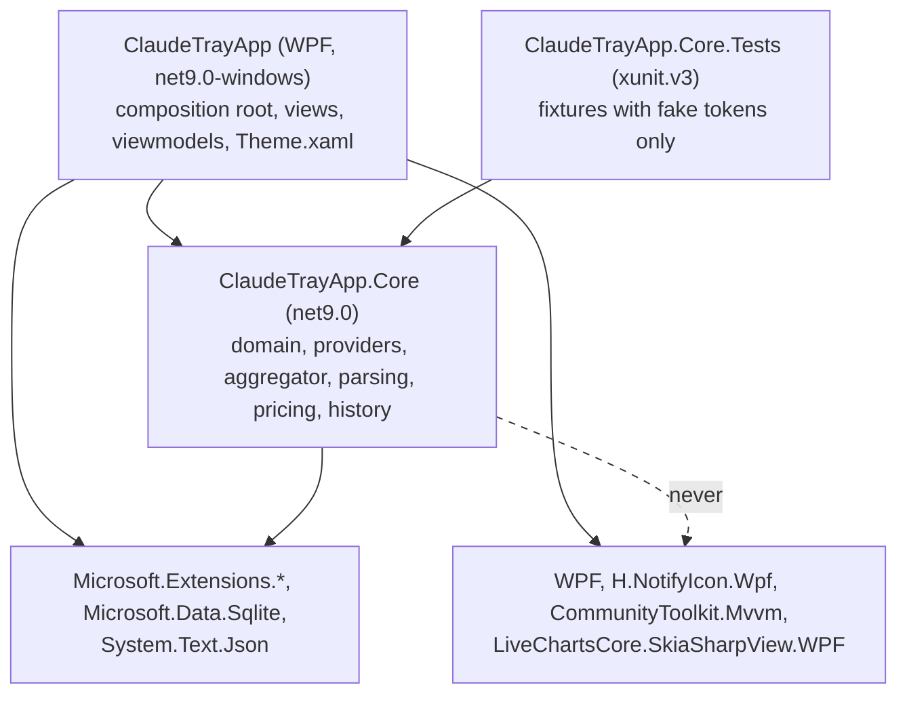
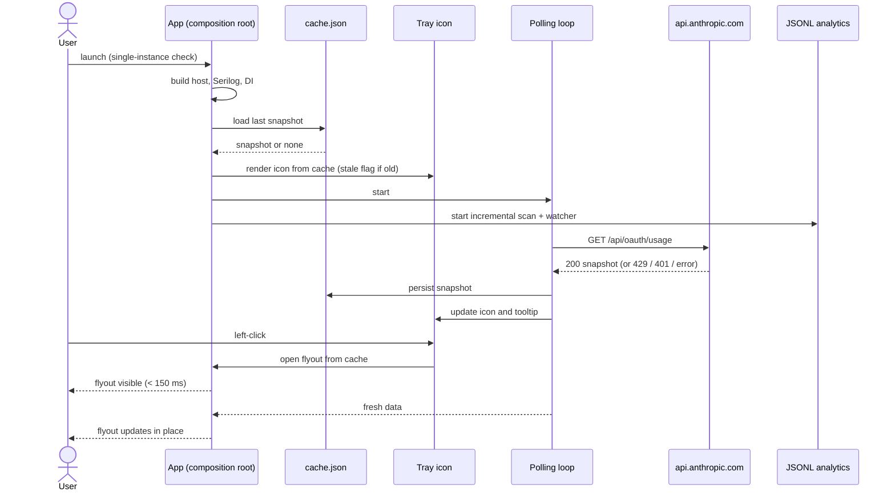

# Architecture

Claude Usage Tray is a WPF tray app with one strict split: everything that talks to the outside world or does
arithmetic lives in `ClaudeTrayApp.Core`; the WPF project only composes, binds and draws.

## Layers

| Layer | Project | Responsibility |
|---|---|---|
| Providers | Core | Turn a data source into a `UsageSnapshot` (OAuth endpoint) or local analytics (JSONL logs). Know about transport, never about UI. |
| Aggregator | Core | Merge provider outputs, label the source of every field, decide the stale and unavailable states. Never fabricates a percentage. |
| History store | Core | SQLite time series of snapshots and daily token/cost rollups, plus JSONL scan offsets and retention pruning. |
| ViewModels | App | Observable adapters over aggregated data via CommunityToolkit.Mvvm source generators. Countdown text and number formatting live here. |
| Views | App | XAML bound to viewmodels. Colours, brushes and fonts come from `Theme.xaml` tokens only. |

Dependency direction is one way: `ClaudeTrayApp` references `ClaudeTrayApp.Core`. Core has no reference to WPF,
H.NotifyIcon or LiveCharts; `tests/ClaudeTrayApp.Core.Tests/CoreArchitectureTests.cs` fails the build otherwise.

## Runtime folders

All paths are resolved by `AppPaths` from environment folders. Nothing is hardcoded to a user, and
`CLAUDE_CONFIG_DIR` relocates the Claude Code home exactly as it does for Claude Code.

| Path | Content |
|---|---|
| `%LOCALAPPDATA%\ClaudeTrayApp\cache.json` | Last successful snapshot. Never contains a token. |
| `%LOCALAPPDATA%\ClaudeTrayApp\history.db` | SQLite history, daily rollups, JSONL scan offsets. |
| `%LOCALAPPDATA%\ClaudeTrayApp\logs\` | Rolling daily logs, seven days, five MB each. Tokens redacted. |
| `%APPDATA%\ClaudeTrayApp\settings.json` | User settings, hot-reloaded. |
| `%USERPROFILE%\.claude\` | Claude Code home. Read-only for this app. |

## Diagrams

Sources live in [`diagrams/`](diagrams/). Edit the source file and this embedded copy together; a wrong diagram
is worse than none.

### Data flow

### Polling state machine

### Components

### Launch sequence

## Status

Milestones 1 and 2 are delivered: solution layout, build settings, CI, `AppPaths`, the composition root with file
logging, the usage domain, credential discovery, the OAuth usage provider, the polling state machine and the
snapshot cache, verified against the live endpoint. The tray icon, flyout, JSONL analytics provider, aggregator,
history store and charts arrive in milestones 3 to 7 and this document is updated with each of them.
