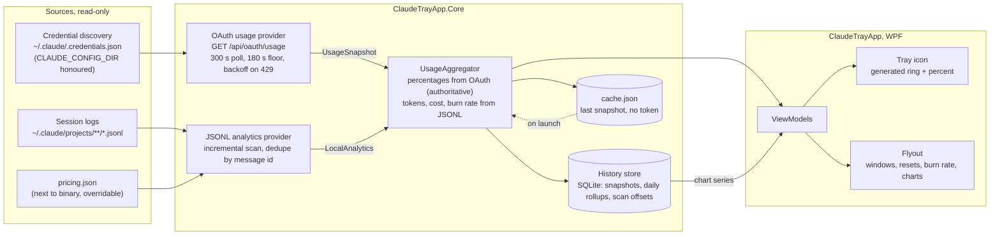
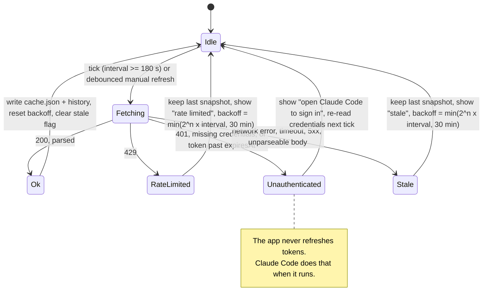
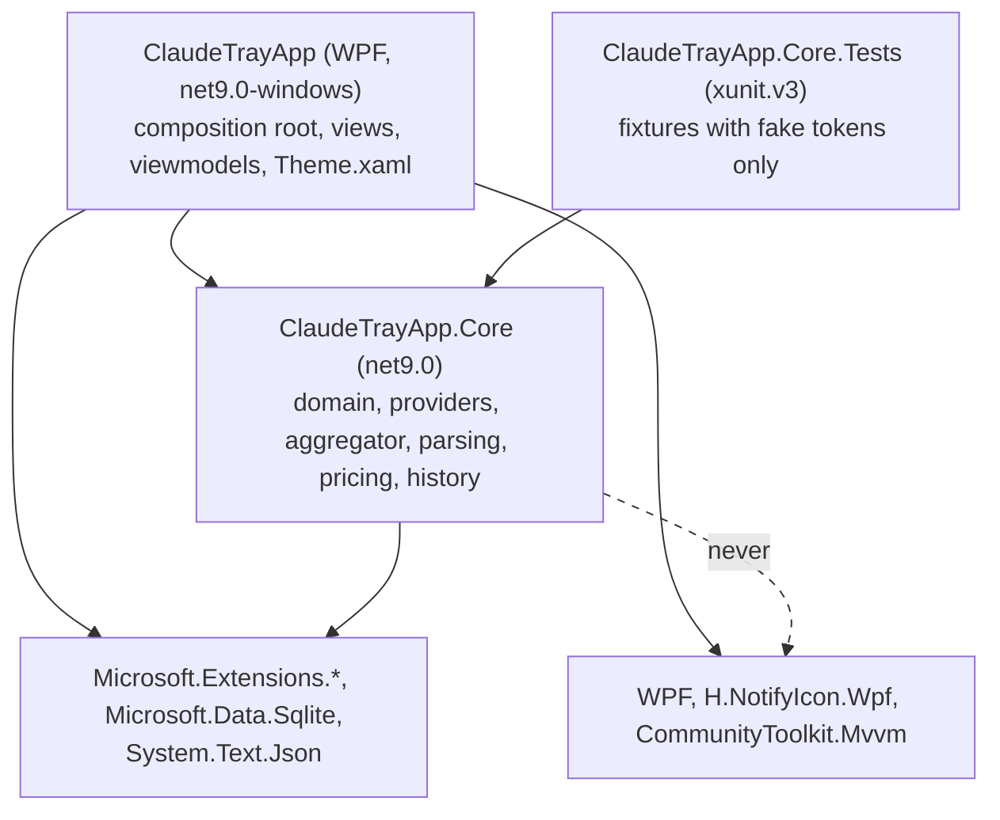
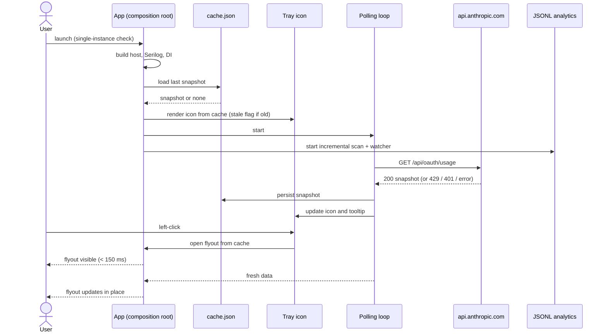

# Architecture

Claude Usage Tray is a WPF tray app with one strict split: everything that talks to the outside world or does
arithmetic lives in `ClaudeTrayApp.Core`; the WPF project only composes, binds and draws.

## Layers

| Layer | Project | Responsibility |
|---|---|---|
| Providers | Core | Turn a data source into a `UsageSnapshot` (OAuth endpoint) or local analytics (JSONL logs). Know about transport, never about UI. |
| Aggregator | Core | Merge provider outputs, label the source of every field, decide the stale and unavailable states. Never fabricates a percentage. |
| History store | Core | SQLite time series of snapshots and daily token/cost rollups, plus JSONL scan offsets and retention pruning. |
| ViewModels | App | Observable adapters over aggregated data via CommunityToolkit.Mvvm source generators. Countdown text and number formatting live here. |
| Views | App | XAML bound to viewmodels. Colours, brushes and fonts come from `Theme.xaml` tokens only. |

Dependency direction is one way: `ClaudeTrayApp` references `ClaudeTrayApp.Core`. Core has no reference to WPF or
H.NotifyIcon; `tests/ClaudeTrayApp.Core.Tests/CoreArchitectureTests.cs` fails the build otherwise.

## Runtime folders

All paths are resolved by `AppPaths` from environment folders. Nothing is hardcoded to a user, and
`CLAUDE_CONFIG_DIR` relocates the Claude Code home exactly as it does for Claude Code.

| Path | Content |
|---|---|
| `%LOCALAPPDATA%\ClaudeTrayApp\cache.json` | Last successful snapshot. Never contains a token. |
| `%LOCALAPPDATA%\ClaudeTrayApp\history.db` | SQLite history, daily rollups, JSONL scan offsets. |
| `%LOCALAPPDATA%\ClaudeTrayApp\logs\` | Rolling daily logs, seven days, five MB each. Tokens redacted. |
| `%APPDATA%\ClaudeTrayApp\settings.json` | User settings, hot-reloaded. |
| `%USERPROFILE%\.claude\` | Claude Code home. Read-only for this app. |

## Diagrams

Sources live in [`diagrams/`](diagrams/). Edit the source file and this embedded copy together; a wrong diagram
is worse than none.

### Data flow

### Polling state machine

### Components

### Launch sequence

## Status

Milestones 1 to 6 are delivered: solution layout, build settings, CI, `AppPaths`, the composition root with file
logging and crash logging, the usage domain, credential discovery, the OAuth usage provider, the polling state
machine, the snapshot cache (verified against the live endpoint), theme tokens with dark and light palettes, the
generated tray icon with its context menu, the flyout, the local analytics pipeline with the SQLite history store
and the aggregator, and the charts. Settings arrive in milestone 7 and this document is updated with them.

## Local analytics pipeline

`LocalAnalyticsProvider` runs as a hosted service: one incremental scan at start, a rescan two seconds after the
session logs change (debounced `FileSystemWatcher`), and a safety-net rescan every five minutes. `JsonlScanner`
keeps a byte offset, length and mtime per file in `SqliteStore`, reads only appended bytes, leaves a trailing
partial line for the next pass, restarts a shrunken file from zero, and skips locked files until the next pass.
`JsonlLineParser` turns assistant records into `UsageEvent`s; the store's primary key on (message id, request id)
deduplicates the several lines one API response produces. On the probed machine the first scan of 530 files
(452 MB) stored 29,063 events in 4.3 s; later scans take under 100 ms. `AnalyticsCalculator` answers questions
on demand from SQL aggregates: today's totals by model priced through `PricingTable`, top projects, and the
current 5-hour block anchored on the endpoint's reset time, with a projection computed only from the endpoint's
percentage. `HistoryRecorder` appends every fresh snapshot per window and prunes past the retention window once a
day. `UsageAggregator` hands the flyout one object whose two halves name their sources.

## Flyout

`FlyoutWindow` is a WPF tool window (`WS_EX_TOOLWINDOW`, no taskbar button, not in Alt-Tab) created once at start
and warmed up off-screen; opening it is a show plus placement, measured at about 100 ms. Placement is pure maths in
`FlyoutPlacement`: the monitor under the cursor and its work area decide the taskbar edge, and the window is moved
with `SetWindowPos` in physical pixels, so mixed-DPI setups work with the PerMonitorV2 manifest. The backdrop is
DWM's transient-window acrylic when available, with a solid surface fallback. Click-outside is handled by the
window's `Deactivated` event and Esc by key handling. `FlyoutViewModel` splits the snapshot into the primary window
(the hero ring, `RingArc`) and the secondary rows, formats every string, and re-renders time-dependent text every
30 s while the flyout is visible.

## Charts

There is no charting package. `Controls/Sparkline`, `Controls/LineChart` and `Controls/BarChart` are small
`FrameworkElement`s that draw with a `DrawingContext` from the brushes they are given, so they follow the palette
like every other view: one hairline baseline, edge labels, a top value, optional vertical markers, and a hover
readout drawn only while the pointer is over the chart. `Charts/ChartDataBuilder` is pure: it downsamples a series
to at most 240 points keeping the highest value per bucket (peaks survive), builds the 5-hour block chart from the
recorded percentages plus a straight projection at the calculator's pace that stops at the reset, and rolls daily
token totals into the top four models plus "other". `Charts/ChartDataLoader` runs the SQLite queries on a
thread-pool thread; `ChartsViewModel` applies the result on the dispatcher and exposes one chart at a time (this
block, history over 24 h, 7 d or 30 d, daily tokens with a by-model toggle). Every chart also produces a sentence,
used as its automation name and shown under it, and a chart without data collapses to that sentence. Sparklines
sit in the hero (the current block) and in each window row (its own period); they stay hidden until readings
cover at least 5 % of the period.

## Threading

Core is a library and every `await` in it uses `ConfigureAwait(false)`; CA2007 enforces that under
`src/ClaudeTrayApp.Core`. The app starts and stops the generic host off the UI thread, so the polling loop never
inherits the dispatcher context, and view models marshal `StatusChanged` to the dispatcher themselves.

## Tray icon pipeline

`UsagePoller.StatusChanged` (background thread) → `TrayIconViewModel.Apply` on the dispatcher → `TrayIconState`
(percent, status, stale) and tooltip → `TrayIconController.Redraw` → `TrayIconRenderer.Render` at the system DPI
pixel size → `IconConverter.ToIcon` → `TaskbarIcon.Icon`. Theme and display changes re-enter at `Redraw`.
