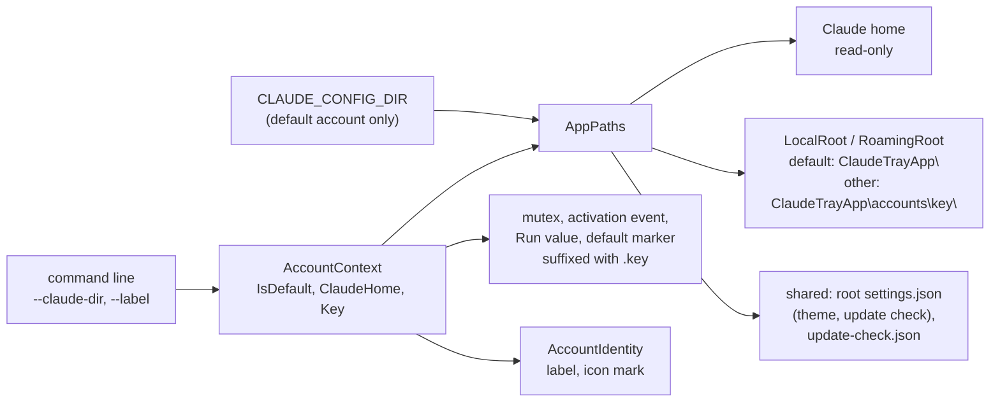

# Accounts

How the command line selects an account and what that account owns. Embedded in `docs/architecture.md` under
"Runtime folders"; edit both together.

```mermaid
flowchart LR
    ARGS["command line<br/>--claude-dir, --label"] --> CTX["AccountContext<br/>IsDefault, ClaudeHome, Key"]
    ENV["CLAUDE_CONFIG_DIR<br/>(default account only)"] --> PATHS
    CTX --> PATHS["AppPaths"]
    PATHS --> HOME["Claude home<br/>read-only"]
    PATHS --> DATA["LocalRoot / RoamingRoot<br/>default: ClaudeTrayApp\<br/>other: ClaudeTrayApp\accounts\key\"]
    PATHS --> SHARED["shared: root settings.json<br/>(theme, update check),<br/>update-check.json"]
    CTX --> NAMES["mutex, activation event,<br/>Run value, default marker<br/>suffixed with .key"]
    CTX --> ID["AccountIdentity<br/>label, icon mark"]
```
