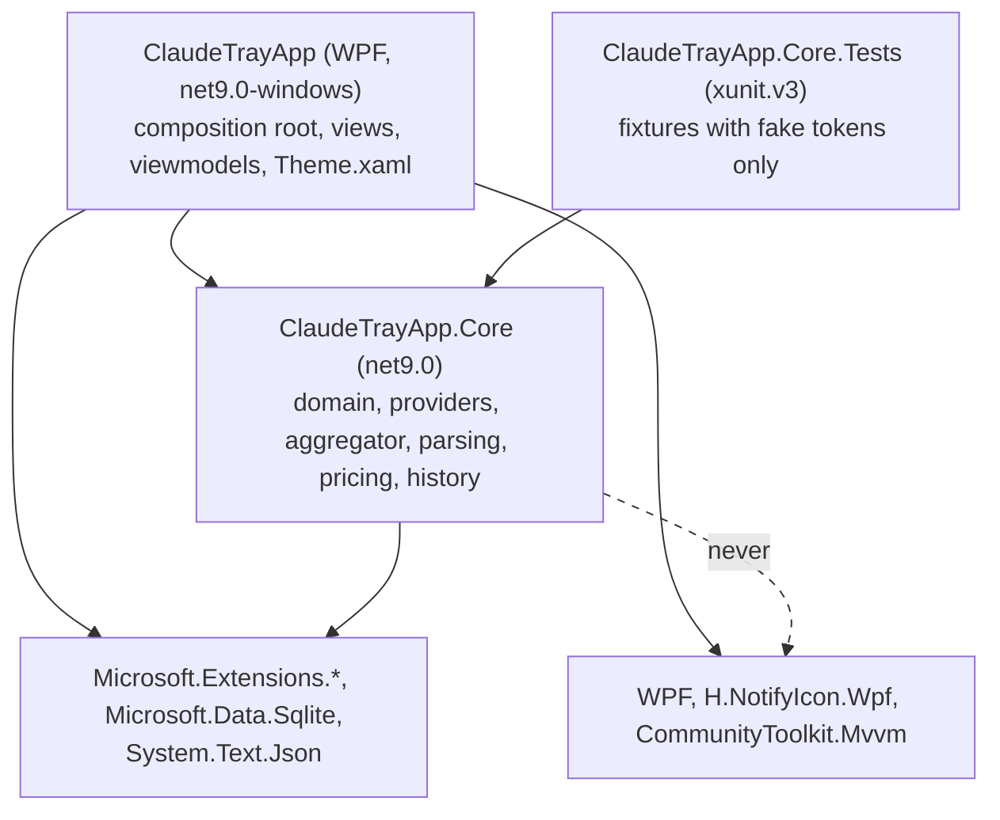

# Components

Projects and their dependency direction. Core has no UI dependency; `CoreArchitectureTests` fails the build if a WPF or H.NotifyIcon assembly is ever referenced from it. Charts are drawn by hand, so no charting package is involved.

