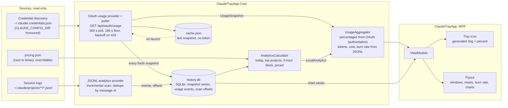

# Data flow

Credential discovery feeds the OAuth provider, whose poller writes every fresh snapshot to the cache and, through the history recorder, to `history.db`. Claude Code session logs feed the local analytics provider, which stores deduplicated usage events and scan offsets in the same database; the calculator prices them on demand. The aggregator merges the two halves for the view models, and the tray icon and flyout render from the merged result.

