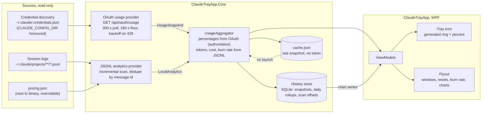

# Data flow

Credential discovery feeds the OAuth provider; Claude Code session logs feed the local analytics provider. The aggregator merges both, persists to cache and history, and the tray icon and flyout render from the merged result.

