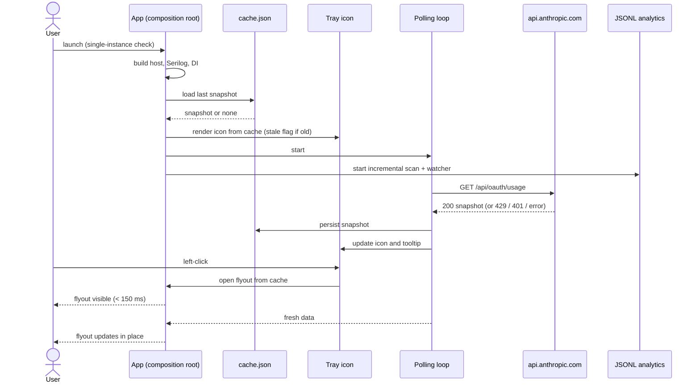

# Launch sequence

App launch to first render to background refresh. The flyout opens from cached data in under 150 ms and updates in place when fresh data arrives.

```mermaid
sequenceDiagram
    actor U as User
    participant App as App (composition root)
    participant Cache as cache.json
    participant Tray as Tray icon
    participant Poll as Polling loop
    participant API as api.anthropic.com
    participant Local as JSONL analytics

    U->>App: launch (single-instance check)
    App->>App: build host, Serilog, DI
    App->>Cache: load last snapshot
    Cache-->>App: snapshot or none
    App->>Tray: render icon from cache (stale flag if old)
    App->>Poll: start
    App->>Local: start incremental scan + watcher

    Poll->>API: GET /api/oauth/usage
    API-->>Poll: 200 snapshot (or 429 / 401 / error)
    Poll->>Cache: persist snapshot
    Poll->>Tray: update icon and tooltip

    U->>Tray: left-click
    Tray->>App: open flyout from cache
    App-->>U: flyout visible (< 150 ms)
    Poll-->>App: fresh data
    App-->>U: flyout updates in place
```
