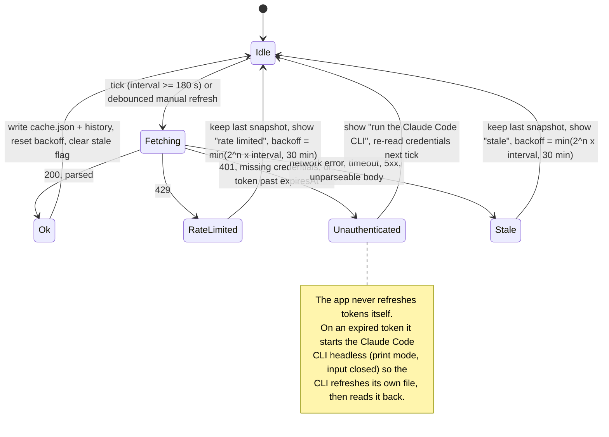

# Polling state machine

The OAuth provider's loop. Every transition back to Idle schedules the next tick; the delay is the configured interval (floor 180 s) or the current backoff, whichever is longer. Manual refresh is debounced through the same limiter and can never bypass a backoff.

